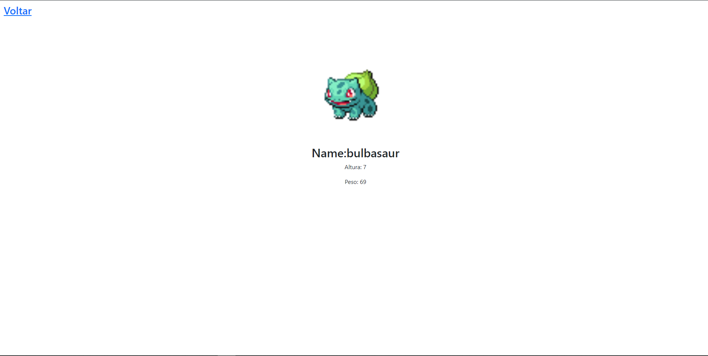

# 🖥 Funcionalidades 
- `Funcionalidade 1:` `Mostra pokemons`:Mostra a lista de pokemons.;
- `Funcionalidade 2:` `Pokemons detalhados`:Mostra dados de cada pokemon detalhado ao clicar;

# ⌛ Status 

# 👨‍💻 Coisas que aprendi 
`1ª:` Usar o useRoute, para pegar a url do site  
`2ª:` Usar o fetch e o await para o uso de APIs 
`3ª:` Criar projetos com NextJs 
`4ª:` Usar rotas do NextJs 

# 🔗 Link 
`1ª:Site`https://poke-api-next-js-sage.vercel.app/   
